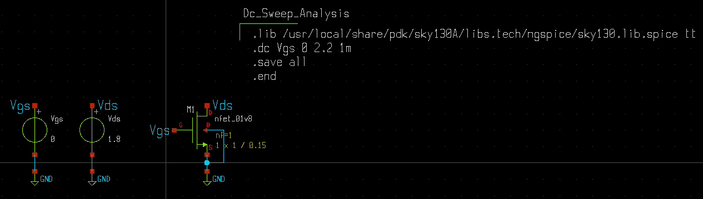
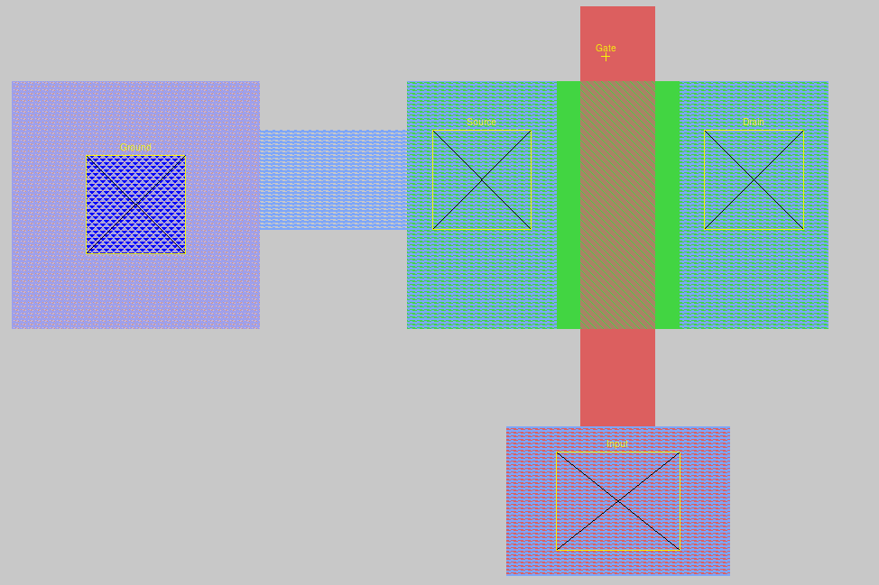
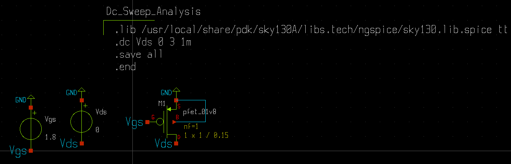
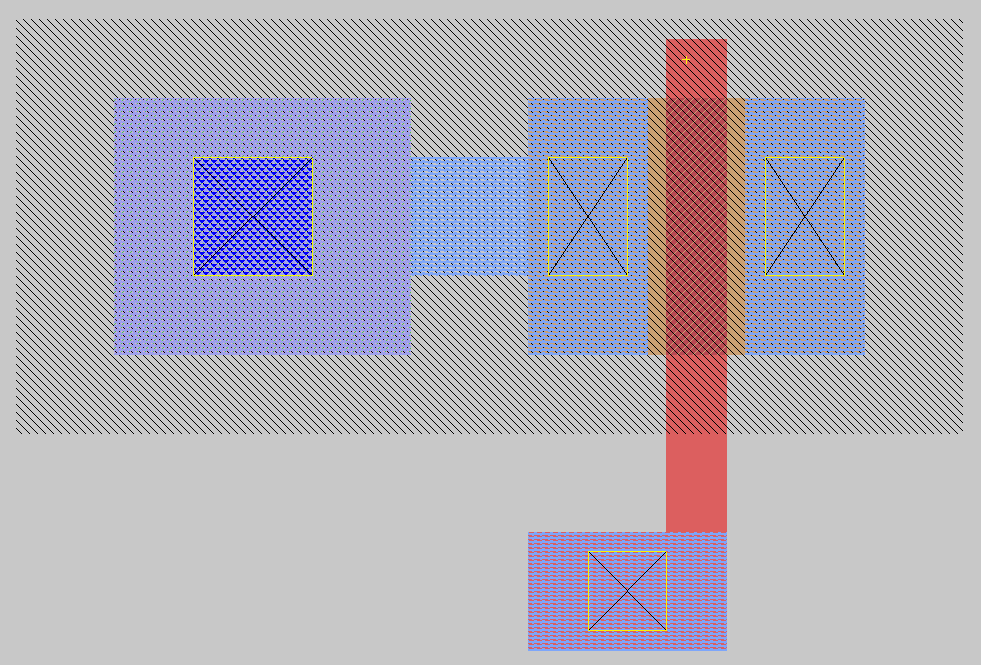

# Transistor Analysis Using Sky130 openpdk

Hi, this is a very basic work into the back-end designing of any VLSI project. In this project we are discussing about the first steps for desiging any circuit into the IC level. Here I am starting with the discussion of standard 1.8V NMOS and PMOS transistors along with their respective graphs and also tried to do the layout desiging.

I am open to any of the suggestions making this more optimized or readable and also to all my VLSI enthusiasts, I am looking forward for some constructive critisims too. 😄

# Table of Contents
- [Introduction To The Tools](#introduction-to-the-tools)
- [What is PDK](#what-is-pdk)
-  [Installation of the Tools and PDK](#installation-of-the-tools-and-pdk)
- [MOSFET Analysis](#mosfet-analysis)
- [Tips and Debugging](#tips-and-debugging)

## Introduction To The Tools
 Firstly before starting we need to discuss about the different set of tools that we are using, in our project. Following is the list of tools we used for the analysis:
- **Xschem**: Schematic design. Basically this tool is used for designing the schematic of our circuits. It is similar to what we perform in PSpice or LTSpice softwares. However being a open source tool we need some more setups to design the circuits and simulate them. In this tool we basically design the circuit keeping close approximation to the theoritical concepts, which we later verify practically.
- **Magic**: Layout design. After finishing our design, we come over to the layout designing of our circuit. This layout design is based on the constraints provided by the process development kit(in our case it is sky130). The layout designed can actually be considered as the practical scenario of our circuit. 
- **Ngspice**: Circuit simulation. This tool is actually responsible for performing all the details of our circuit. In simple words, if we want to define the SPICE language, it is similar to that of the machine code. The purpose of SPICE language is to model our circuit into a format which is easily understandable globally.
- **Netgen**: LVS verification. LVS stands for Layout Versus Schematic. This tool is used to compare the spice files generated by our schematic capture tool and the layout design tool and to verify that our layout resembles our schematic actually.

You can further deep dive into each of the tools and learn more about them and their usage.

## What is PDK? 

A **PDK** (Process Design Kit) is a collection of files and tools that provide the necessary information for designing integrated circuits (ICs) or semiconductor devices for a specific manufacturing process. It includes design rules, models, libraries, and other resources that help engineers create designs that can be fabricated using a particular process. Here in our case we have used a open-source PDK provided by Skywater technologies and Google working on the 130nm node, that is the minimum feature size has to be 130 nm for the fabrication.

### Key Components of a PDK

1. **Design Rules**  
   Specifications that define the limitations and requirements for layout geometry, such as minimum feature sizes, spacing between elements, and other physical constraints.

2. **Technology Files**  
   Descriptions of the layers, materials, and other parameters that define the fabrication process (e.g., types of metals, dielectrics, and transistors).

3. **SPICE Models**  
   Simulation models of the transistors and other components in the process, used for circuit simulation.

4. **Standard Cell Libraries**  
   Pre-designed and characterized digital components (e.g., logic gates, flip-flops) that can be used in IC designs.

5. **Process Flow**  
   Describes the steps required to fabricate devices using the process, such as photolithography, etching, and deposition.

### Purpose of a PDK

PDKs are essential for creating designs that are compatible with the capabilities and limitations of the chosen fabrication process. They help ensure that designs are manufacturable and perform as intended when built.


## Installation of the Tools and PDK
Here comes the hectic part of the process. Installation of the open source tools. However I have provided with some scripts that can be used for the installation process.
**Reminder:** All the development is done in linux environment. So you have to either use Linux distro, or can use VMs and WSL also. (I personally worked in Ubuntu 24.04 LTS)

```bash
chmod +x EDA_tools.sh  # Make the script executable #Do this for EDA tools
./EDA_tools.sh         # Execute the script
```
```bash
chmod +x open_pdk_install.sh # Make the script executable # Do this for open-pdk intallation
./open_pdk.sh                # Execute the script
```

## MOSFET Analysis
For both NMOS and PMOS I have selected the standard 1.8V mosfets from the sky130 foundry(nfet_01v8.sym and pfet_01v8.sym) and performed the analysis for the same parameters listed below:
- Threshold Vgs Value
- Ids vs Vgs
- Transconductance
- Ids vs Vds
- On Resistance

The exact values can be seen in the [result.txt file](./result.txt) Below are the detailed circuits, graphs and layout for each NMOS and PMOS respectively.

### NMOS Results:
 Circuit:
 
 This is done using Xschem for the schematic capture.
 
 Layout:
 
 This is done using Magic Vlsi. Here the technology node is sky130B. Also the measurements taken are in the 50nm x 50nm grid with snap to grid on. In short the layout is slightly larger than the optimum theoritical result.

 ### PMOS Results:
 Circuit:

 

 Layout:
 
 


 For the Graphs related to each, you can visit the [Graphs](./Graphs) section.


## Tips and Debugging

The scripts I provided will install everything in the home directory. However to integrate the open-pdk to your xschem and magic there are some procedures:
- Install Xterm first, as all you can use it for writing all the commands for your xschem while keeping the main terminal free.
```bash
sudo nala install xterm
``` 
- The following link will tell you the process of integrating xschem with sky130 pdk: [xschem sky130 integration](https://xschem.sourceforge.io/stefan/xschem_man/tutorial_xschem_sky130.html)

- For integrating magic with sky130B tech files, as your xschem is getting for schematic capture, go to this path:
```bash
/home/<user_name>/open_pdks/sky130/sky130B/libs.tech/magic
```
Inside this path you'll find a file named **sky130B.magicrc**. Copy this file and paste it in the home directory by renaming it to "**.magicrc**". This will be a hidden file. Also do enable viewing hidden files (starts with .file_name). If there exists any .magicrc file previously, remove that first then paste this. In this way your magic tool will always start with integrating the **sky130B** tech files.
 
# Conclusion

The sole purpose of this work is to provide the basic details of how the backend works in VLSI domain. Also it is to be discussed that there are several reasons I skipped some parts from this Readme file, like the concept of Strong 0 and Strong 1 conduction for NMOS and PMOS respectively. Also the spice commands that are present in the schematics are not explained in depth. In future I plan to work on a inverter design where I will be talking about these in details.

